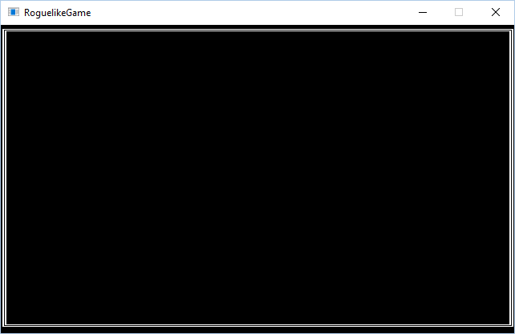
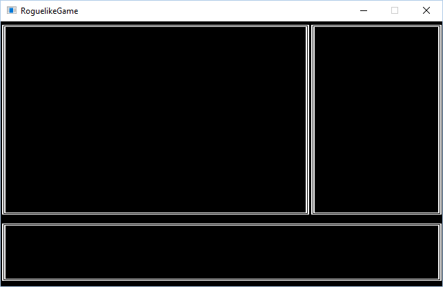
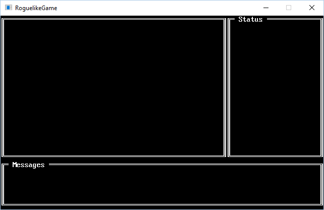

# Part 2 - Doing more with our console

In this series of tutorials we'll look at creating a roguelike while using SadConsole. SadConsole is a .NET library that works with MonoGame to create a tile based game. The focus of SadConsole though is to treat the tile system like a classic terminal or command prompt system.

##### Tutorial index
- [Part 1]()
- Part 2 
- More coming soon...

## Drawing more on our console

Now that we have a basic SadConsole game up and running, we can start to manipulate the console data to draw shapes, rooms, text and things like that. However, let's create our own console based on the console provided by SadConsole. Why not just use the `SadConsole.Consoles.Console` like we did in the previous tutorial? We can control more about what and how the console displays information, and reuse it.

Let's make a new console that draws a border around it no matter the size. Add a new class to your project named *BorderedConsole.cs*. Open that file and inherit from `SadConsole.Consoles.Console`. You'll need to rewrite the constructor to support `width` and `height`.

```csharp
class BorderedConsole: SadConsole.Consoles.Console
{
    public BorderedConsole(int width, int height): base(width, height)
    {
        
    }
}
```

Now we have a console that can be reused. It doesn't do anything special yet so let's add the border code to the constructor:

```csharp
public BorderedConsole(int width, int height): base(width, height)
{
    SadConsole.Shapes.Box box = SadConsole.Shapes.Box.GetDefaultBox();
    box.Width = width;
    box.Height = height;
    box.Draw(CellData);
}
```

Go back in the initialization code from part 1 (*MyGame.cs*) that looked like this:

```csharp
SadConsole.Consoles.Console testConsole = new SadConsole.Consoles.Console(80, 24);

testConsole.CellData.Print(2, 2, "Hello world");

SadConsole.Engine.ConsoleRenderStack.Add(testConsole);
```

Erase that code and create and add a new bordered console:

```csharp
var panel1 = new BorderedConsole(80, 24);

SadConsole.Engine.ConsoleRenderStack.Add(panel1);
```
Now run the program and you should see our bordered console:



We can easily reuse this console now. So instead of the code we just wrote, let's create three consoles and position them on the screen. Let's create a console for the following: 

* Main view of the map
* Status panel for health
* Message console for what's happening in the game.

```csharp
var viewConsole = new BorderedConsole(56, 18);
var statsConsole = new BorderedConsole(24, 18);
var messageConsole = new BorderedConsole(80, 6);

viewConsole.Position = new Point(0, 0);
statsConsole.Position = new Point(56, 0);
messageConsole.Position = new Point(0, 18);

SadConsole.Engine.ConsoleRenderStack.Add(viewConsole);
SadConsole.Engine.ConsoleRenderStack.Add(statsConsole);
SadConsole.Engine.ConsoleRenderStack.Add(messageConsole);
```

Now the game screen should look like this:



#### Adding a title to our border console

Let's enhance our new console with a customizable title. Add a new constructor to *BorderConsole.cs* that takes a string parameter and writes that string along the top border.

>**TIP**  
You can do this easily by having the new constructor call the existing constructor (*this* keyword instead of *base*) and then add any additional code for this specific constructor.

```csharp
public BorderedConsole(string text, int width, int height) : this(width, height)
{
    CellData.Print(2, 0, text);
}
```

Now update consoles `statsConsole` and `messageConsole` to have a title:

```csharp
var viewConsole = new BorderedConsole(56, 18);
var statsConsole = new BorderedConsole(" Status ", 24, 18);
var messageConsole = new BorderedConsole(" Messages ", 80, 6);
```



## Closing thoughts

We've initialized MonoGame, configured SadConsole, and displayed a simple console with some character data. Pretty simple huh? A few lines of code and we're off and running.

In the next step (coming soon) of the tutorial we'll create our own custom console and display a player character on it.